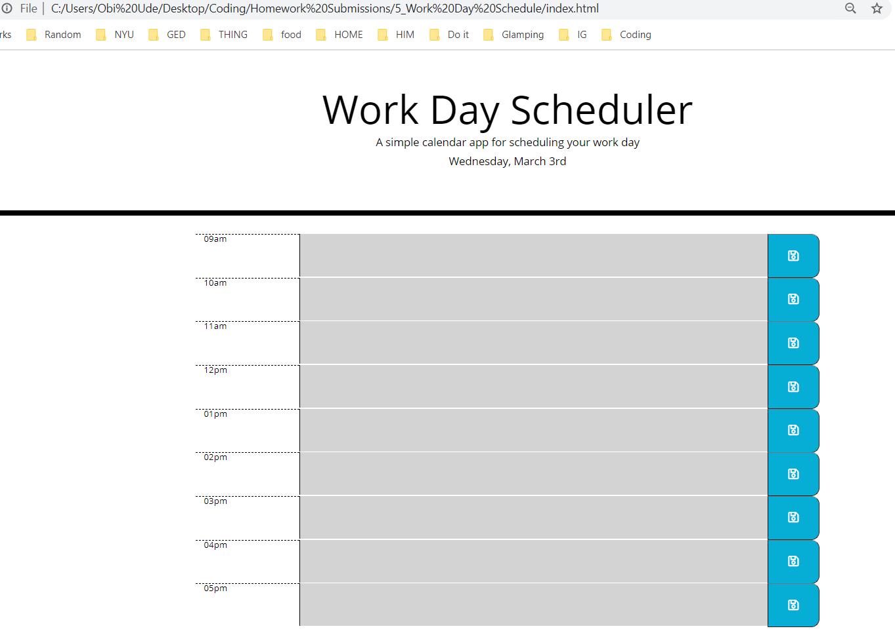

* [Acceptance Criteria](#acceptancecriteria)
* [Project Status](#projectstatus)
* [License](#license)
* [Deployment](#deployment)
* [Usage](#usage)
* [Preview of the App](#previewApp)

# Workday Planner
 
For this project, I aim to improve the functionality of a standardized work day planner.  This planner will enable its user to track their lists in real-time using the moment library. My main motivation for this project is to utilize Bootstrap, jQuery, and moment to create an easy funtioning planner that saves its data in local storage and appeals to its users.  To ensure the accessiblity of the app, there will be a visually appealing coclor contrast that reresents the past, present and future. Being able to accomplish this workday planner will increase the productivity of any user's day.    

# Acceptance Criteria
GIVEN I am using a daily planner to create a schedule
WHEN I open the planner
THEN the current day is displayed at the top of the calendar
WHEN I scroll down
THEN I am presented with timeblocks for standard business hours
WHEN I view the timeblocks for that day
THEN each timeblock is color coded to indicate whether it is in the past, present, or future
WHEN I click into a timeblock
THEN I can enter an event
WHEN I click the save button for that timeblock
THEN the text for that event is saved in local storage
WHEN I refresh the page
THEN the saved events persist

# Project Status
This project was completed on March 6, 2021. 

# License
MIT

# Deployment

Access this document here: https://github.com/Obi1002/Workday-Planner
[Live Link](https://obi1002.github.io/Workday-Planner/) 

# Usage
When you open the webpage, you will have a live work day planner presented to you.  Fill in tasks and save.  As your work day progresses, you will be able to visually to see the past hour(s), current hour and future hour(s) all in different colors. Enjoy your new planner!

# Preview of the App
* This is how the app looks
